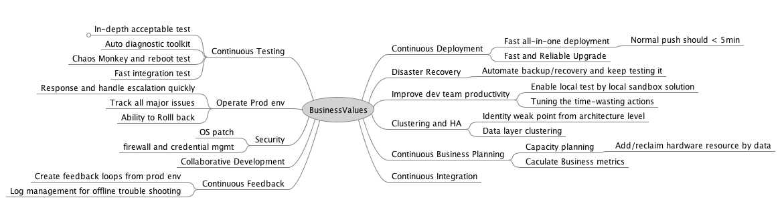
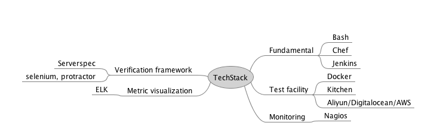
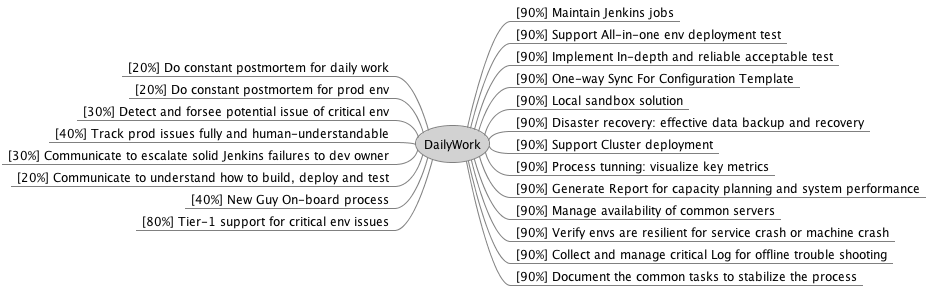

# DevOps-knowledgebase

DevOps Role = Automation Engineers + Ops + Quality Engineers + Automation + Security/Network

Characteristics Of DevOps Work:

1. Different projects/products usually have many similar requirements or overlapped tasks.
2. Most tasks are off the record and trivial to plan, therefore hard to track effort for credit in-return
3. If fail to foresee potential risks of critical envs, DevOps life can easily be frustrating and fruitless.
4. All team members may contact with DevOps, so watch out low efficiency of communication.

| Name                                   | Comment                                                    |
|:----------------------------------------|------------------------------------------------------------|
| [DevOps Guide](./guide) | Guide links for questions frequently asked by dev team  |
| [DevOps Common libraries](./code) | Scripts and common libraries for DevOps daily work|
| [DevOps Process Template](./ProcessTemplate) | Routine DevOps work provide reusable process template |
| [DevOps TechStack](./TechStack) | Tech stack people should be familiar with, when doing DevOps |
| [DevOps BusinessValue](./BusinessValue) | What business values do DevOps mean to customers |
| [DevOps Consultant](./CustomerConsultant) | Experience for doing DevOps Consultant |

We maintain current github repo, in hope of:

1. Standardize routine work with minimum effort and maximum output.
2. Separate what tasks need intensive communication/prompt response from those don't
3. Measure key tasks by statistics and generate visualize  report.
4. Figure out a way to keep things/tasks in order and properly tracked

## Requirement for DevOps members
1. Interest
2. Adaptive to change and comfortable to play with latest technology
3. Strong desire to automate any routine work
4. Trouble shooting skills

Link Of Current Page: https://github.com/DennyZhang/devops-knowledgebase
