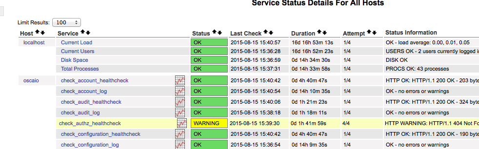
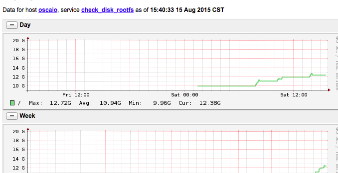

Check nagios
============

## === Nagios Link
http://$nagios_server_ip:$nagios_server_port/nagios/

## Check Backend command of Nagios check
If one nagios check fails, people would like to understand what command it runs eventually.

Let's say check_mfa_healthcheck fail, we can find out the backend command by below steps.
ssh to the vm, take aliyun staging env as an example: ssh -p 6022 root@123.57.240.189
grep check_mfa_healthcheck /etc/nagios/nrpe.d -r

## Enforce nagios checks manually by command line
ssh to the env, then run "enforce_all_nagios_check.sh" in command line.

When run the checks manually, skip certain tests.
In below command, checks matching check_*_log, check_*_cpu or check_disk_rootfs will be skipped.
enforce_all_nagios_check.sh "check_.*_log|check_.*_cpu|check_disk_rootfs"

## Check history of a given nagios check
To check history of one check, here is an example:  telasticsearch mem utilization
http://$nagios_server_ip:$nagios_server_port/nagiosgraph/cgi-bin/show.cgi?host=oscaio&service=check_disk_rootfs

